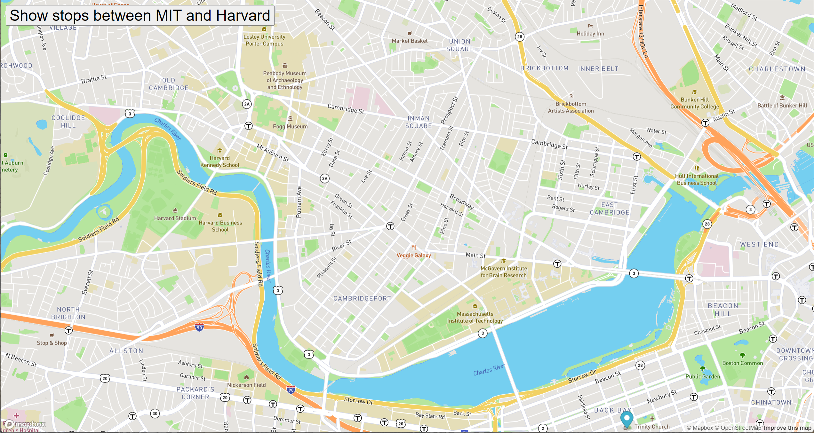

# BusBoston
## This bus tracker shows all of the T stops between MIT and Harvard using publicly available MBTA data. 

For future improvements, I plan on changing the program so that the user can select the locations they wish to view T stops between. I'd also like to apply this same concept to different cities using their public transport information. 
